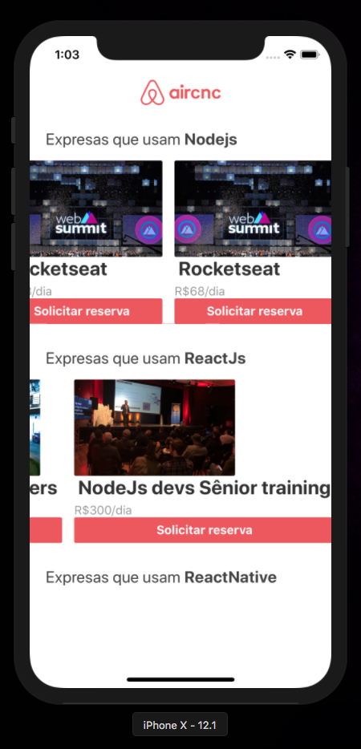
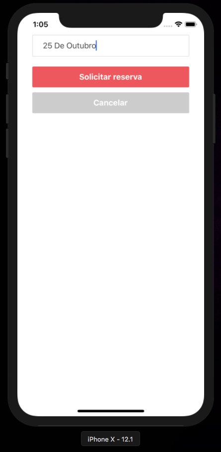
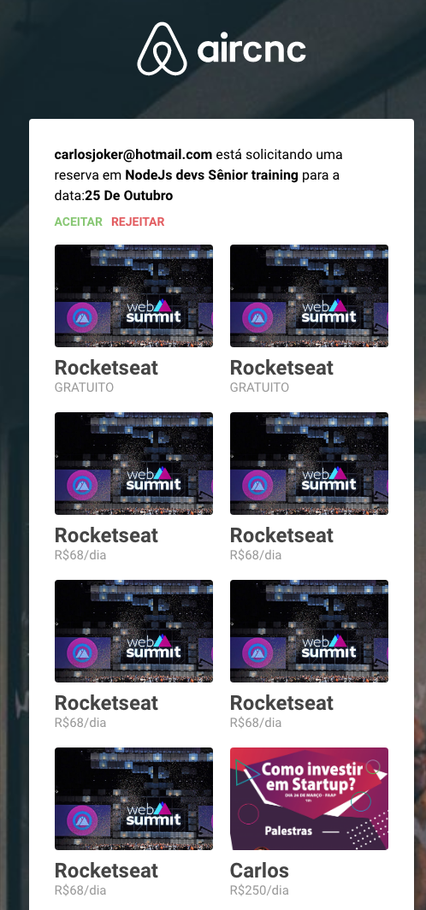
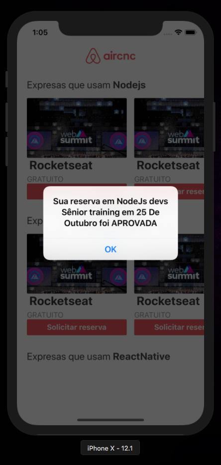

Esse é o exercício proposto pela semana omnistack, criar uma aplicação do zero que consuma uma api em express, usando Frontend em ReactJs, e Mobile em ReactNative, com socketio em tempo real implementado e banco de dados mongodb

# Demonstração

